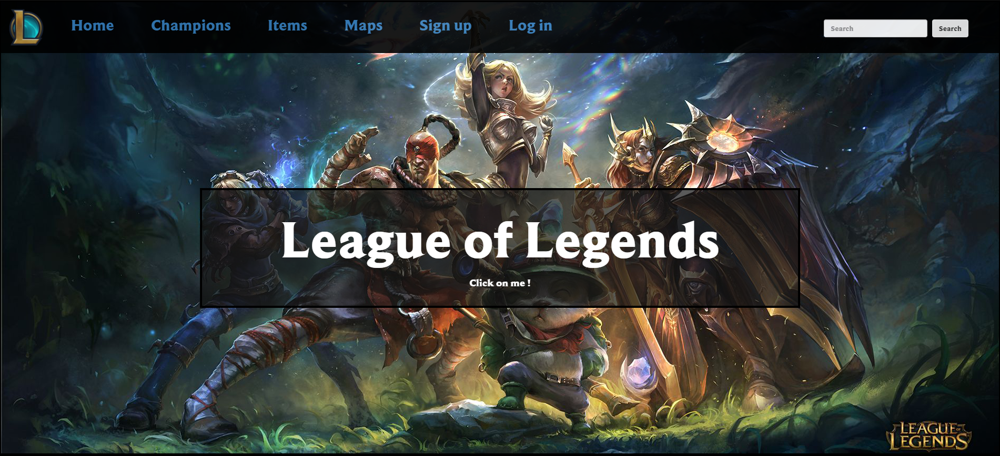
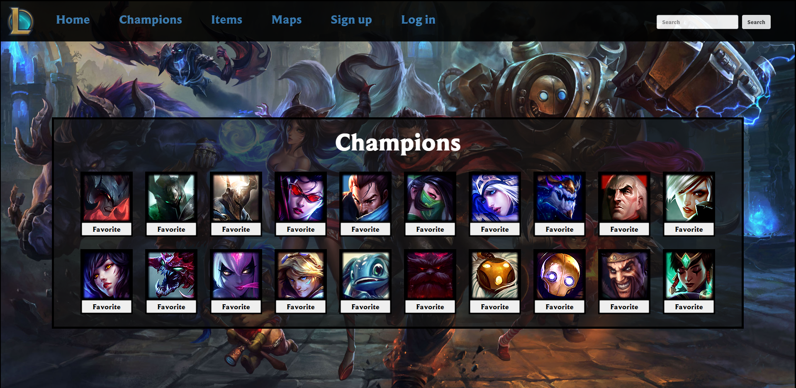
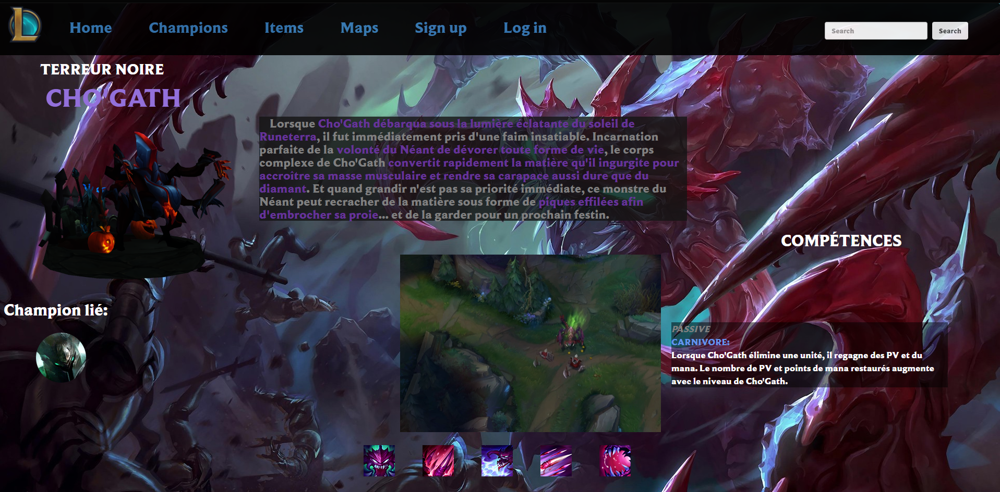
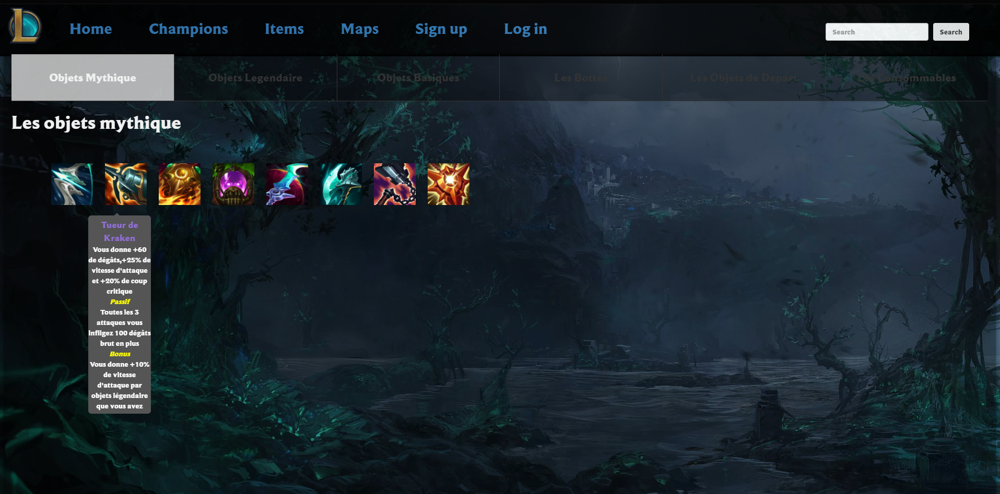
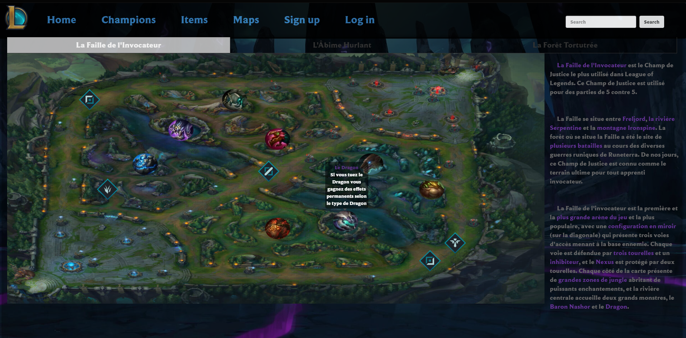
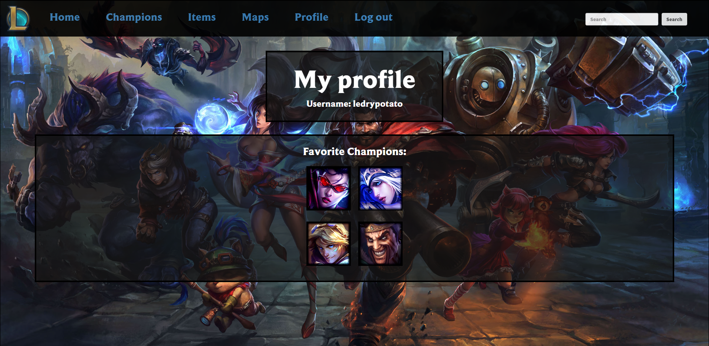

<h1 align="center"> League of Legends Website </h1>
 

  

  
  
  
  
  

>## Project:
Website based on the game League of Legends. This project was completed in the third year of my Computer Science degree at the F.S.T Limoges (France) with Yoann SOCHAJ.

>## Technology used:
- HTML
- CSS
- Javascript
- PHP
- SQL

>## Features:
The top navbar allows the user to navigate between multiple pages:
- The main page contains information about the game and how to download it.
- The champion list page contains icons of 20 different champions which can be found in the game. If you click on their icon you will be redirected a page detailing that champion.
- A specific champion page contains its 3D Model (all models are from [SketchFab](https://sketchfab.com/)) rotating using [Three.js](https://threejs.org/), information about the champion's history, their spells with videos demonstrating them in game as well as linked champions.
- A page containing items that can be found in the game. Hovering over a specific item will pop-up information about it.
- A page containing the different maps in League of Legends again with interactive icons to hover over.
- A Sign up & a Log in page (users are stored in the database and their passwords are encrypted).
- A profile page appears when you are logged in to your account. You can now favorite your champions on the champion page and they will appear on your profile page.

>## Authors:
- Matt TAYLOR
- Yoann SOCHAJ [(GitHub profile)](https://github.com/YoannSo)
